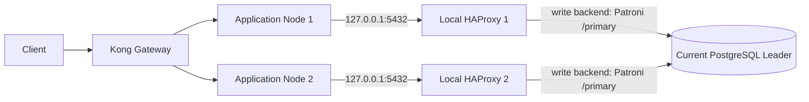

# PostgreSQL Patroni and Local HAProxy Implementation Plan

## Decision

Run one HAProxy daemon on each application node. Bind PostgreSQL listeners only on loopback. Each HAProxy instance independently checks Patroni roles and forwards writes to the current leader. The application uses one normal PostgreSQL pool pointed at its local write listener; application-side Patroni discovery, a leader cache, and a comma-separated PostgreSQL host list are not part of this design.

Loopback avoids an extra network hop between the application and its local HAProxy. It does not mean zero latency: HAProxy still accepts and forwards each TCP stream, and the database remains a network hop away.



## Environment Facts to Confirm

Staging Patroni API endpoints provided for this setup:

| Member | Patroni API URL | PostgreSQL host/port |
| --- | --- | --- |
| node1 (DB-dev) | `http://196.251.146.233:8008` | Confirm with database operations |
| node2 (DB-dev) | `http://196.251.146.233:8009` | Confirm with database operations |
| node3 (DB-dev) | `http://196.251.146.233:8010` | Confirm with database operations |

The Patroni API ports are health-check ports, not PostgreSQL ports. The supplied staging details do not establish PostgreSQL ports or whether all members share one database host address. The APDB addresses and PostgreSQL port in the original sample configuration must also be verified against the intended production inventory before use. Do not copy production destinations into staging.

The latest staging HAProxy snippet uses `check port 8008` for all three members, but the supplied staging API URLs use ports `8008`, `8009`, and `8010`. Set each server's check port to its matching Patroni API port; otherwise node2/node3 health checks will query the wrong listener.

Patroni's `GET /primary` returns HTTP 200 only on the current primary/leader. `GET /replica` returns HTTP 200 only on a healthy replica. HAProxy uses these checks to mark PostgreSQL backend servers up or down; PostgreSQL traffic itself goes to the member's PostgreSQL port.

## HAProxy Configuration Template

Install and run HAProxy on every application node, and manage the configuration identically on all nodes. This is a template, not a deploy-ready file: replace every `<...>` PostgreSQL destination with the verified host and port. For the provided staging cluster, use check ports 8008, 8009, and 8010 respectively.

```haproxy
global
    log /dev/log local0
    maxconn 4096
    user haproxy
    group haproxy

defaults
    log     global
    mode    tcp
    option  tcplog
    option  dontlognull
    retries 3
    timeout connect 5000ms
    timeout client  50000ms
    timeout server  50000ms

listen postgres_write
    bind 127.0.0.1:5432
    mode tcp
    option httpchk GET /primary
    http-check expect status 200
    default-server inter 3s fall 3 rise 2 on-marked-down shutdown-sessions
    server node1 <PG_NODE1_HOST>:<PG_NODE1_PORT> maxconn 250 check port 8008
    server node2 <PG_NODE2_HOST>:<PG_NODE2_PORT> maxconn 250 check port 8009
    server node3 <PG_NODE3_HOST>:<PG_NODE3_PORT> maxconn 250 check port 8010
```

The supplied HAProxy config may also define `postgres_read` on local port `5433`, but this application will not connect to it in this rollout. Every application query, including reads, goes through the write listener on `127.0.0.1:5432` and therefore reaches the current leader. Replica routing is deferred.

With `inter 3s fall 3`, HAProxy normally needs about three failed checks, roughly nine seconds plus check/network scheduling time, before marking a member down. This is not a three-second failover guarantee. Total recovery also includes Patroni election/promotion and PostgreSQL recovery. `on-marked-down shutdown-sessions` closes existing sessions to a server marked down; active queries and transactions can fail during that transition.

## Application Changes

`DatabaseService` currently creates one `pg.Pool` from `DATABASE_HOST`, `DATABASE_PORT`, credentials, SSL, and pool-size settings. For primary/write traffic, no application-side Patroni client, leader cache, multi-host parser, or new pool is needed. On every app node, set the existing deployment environment to:

```dotenv
DATABASE_HOST=127.0.0.1
DATABASE_PORT=5432
```

Apply these values to both the API process and any co-located worker process that accesses PostgreSQL. Do not put the PostgreSQL password in the HAProxy config. Preserve the database's existing TLS/auth requirements: HAProxy runs in TCP mode and passes the PostgreSQL connection through.

Before production rollout, make these application/deployment follow-ups:

- Ensure HAProxy is enabled and healthy before PM2 starts the API and CDC worker. Configure the host service manager's ordering or deployment health gate; the current PM2 configuration does not declare a HAProxy dependency.
- Add a finite PostgreSQL `connectionTimeoutMillis` to the pool configuration and make it configurable for deployment. The current pool leaves connection timeout unspecified. This bounds connection establishment waits; it does not make an ambiguous write safe to retry.
- Add or adjust a readiness endpoint so Kong can remove an app node when its DB dependency is unavailable. The current `GET /health` returns top-level `status: "ok"` even when its database dependency check reports `unhealthy`; do not use that response as a database-ready signal without correcting its HTTP status/readiness contract. Keep liveness separate from readiness.
- Do not add application-side leader discovery or caching. On failover, HAProxy moves new TCP connections to the new leader; existing sessions can be terminated and their current request may fail.
- Do not automatically replay every write after connection loss. A timeout or reset may occur after PostgreSQL committed. Retry only operations whose execution is known not to have occurred or whose business operation is protected by an idempotency key; transactions must be restarted as a whole when safe.

The example `.env.example` currently represents a local developer database. Keep that workflow usable unless local development also runs HAProxy; set `DATABASE_HOST` and `DATABASE_PORT` in each target node's deployment environment/secret manager instead of putting production values or credentials into source control.

### Deferred Read-Only Routing

This codebase currently has one general-purpose `DatabaseService` pool used for reads, writes, and transaction clients. Do not point it at the `5433` read listener. To add replica reads later, implement a separately configured read pool, make read-only intent explicit at service/repository call sites, keep transactions and read-after-write reads on the write pool, and test behavior under replica lag and promotion. No current query should be routed to replicas just because the listener exists.

## Deployment and Validation Sequence

1. Confirm for each environment the PostgreSQL address/port, Patroni API address/port, app-node addresses, and firewall rules. The Patroni REST API and PostgreSQL ports must be reachable from each app node, but neither should be publicly exposed.
2. Install HAProxy on both application nodes. Bind listeners only to `127.0.0.1`; allow PostgreSQL traffic from app nodes to database nodes and Patroni health checks from app nodes to the Patroni API ports.
3. Deploy the environment-specific HAProxy config to both nodes and validate it with `haproxy -c -f /etc/haproxy/haproxy.cfg`. Enable/restart HAProxy through the host service manager.
4. Verify exactly one member returns HTTP 200 for `/primary`. Check HAProxy's stats/socket or logs to confirm only the leader is UP in the write backend.
5. From each app node, connect to `127.0.0.1:5432` and verify `SELECT pg_is_in_recovery()` returns `false`.
6. Set `DATABASE_HOST=127.0.0.1` and `DATABASE_PORT=5432` in staging, restart API and worker processes after HAProxy is ready, and verify DB readiness through the application readiness endpoint.
7. Perform a planned staging Patroni switchover. Confirm the write backend follows the elected leader, pooled connections recover, and the application does not blindly replay an ambiguous write. Measure detection and total recovery rather than assuming the check interval is the failover time.
8. Roll out to production only after staging results and node/port mappings have been approved. Keep a rollback to the previous DB endpoint available until the new listener is verified.

## Pros and Cons

| Benefits | Costs and risks |
| --- | --- |
| No Patroni HTTP lookup in the application request path and no per-process leader cache to expire or invalidate. | HAProxy configuration and service monitoring must be deployed consistently on every app node. |
| App-to-proxy traffic stays on loopback, avoiding an extra network hop to a shared proxy. | Loopback still incurs HAProxy and socket processing; it is low overhead, not literally zero latency. |
| Each app node independently routes to the current leader, avoiding a single shared proxy host. | Each local daemon is a dependency for its app node; a local HAProxy failure removes that node's database connectivity until repaired. |
| Existing node-postgres write pool can keep one host/port configuration. | Existing pooled connections may be interrupted at promotion; a failed response can leave write commit outcome uncertain. |
| All app traffic uses one write path for the initial rollout. | Reads are not load-balanced across replicas until a separate read pool is intentionally implemented. |
| Kong continues balancing HTTP traffic across app nodes while each app node handles its own DB routing. | Failover duration includes HAProxy check thresholds, Patroni promotion, and connection recovery; it is not instantaneous. |

## Related Documents

- [Patroni REST API collection](../postman/Patroni%20REST%20API.postman_collection.json)
- [Patroni staging Postman environment](../postman/Patroni%20-%20Staging.postman_environment.json)
- [DatabaseService](../src/core/database/database.service.ts)
- [Database configuration](../src/config/configuration.ts)
