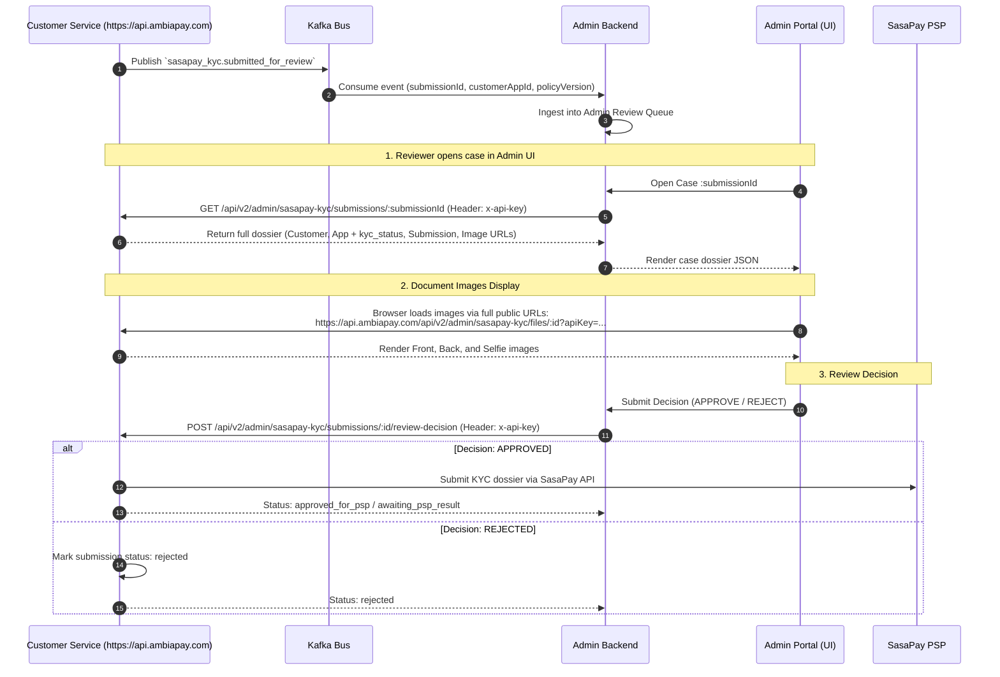

# SasaPay KYC Admin System Implementation Specification

## Executive Summary & Scope

This document specifies the exact requirements, architecture, API contracts, UI workflows, and security controls that the **Admin System (Admin Portal & Admin Backend)** must implement to support the SasaPay KYC verification lifecycle defined in [sasapay-kyc-plan.md](file:///E:/ELIGE/customer-service/docs/sasapay-kyc-plan.md).

### Core Boundaries & Principles
1. **Isolated Infrastructure (Zero Shared Filesystem):** The Customer Service and Admin System run in completely separate application runtimes and server environments (containers/VMs). **They do not share a common filesystem, disk volume, or direct database access.**
2. **Proper Admin GET API with Full URLs:** The Admin System fetches customer KYC dossiers via a comprehensive GET endpoint. Rather than returning raw byte streams, the API returns:
   - Complete **Customer details** (identity, contact, account status).
   - Complete **Application details** (including current `kyc_status`, tier, and SasaPay account metadata).
   - Complete **Submission details** (SasaPay KYC workflow state, timestamps, reasons).
   - Full **Public Document URLs** constructed using the public service domain `https://api.ambiapay.com`.
3. **API-Key Authentication (`x-api-key`):** Machine-to-machine admin endpoints authenticate using a pre-shared Admin API Key (`x-api-key` or `?apiKey=...`), eliminating dependencies on customer user JWTs.
4. **Targeted State Updates:** Admin review decisions must **only** update the specific `sasapay_kyc` submission record. Admin actions **must never overwrite** the shared `customer_applications.kyc_status` or the customer lifecycle status (`customers.status`).
5. **Internal Approval ≠ SasaPay Approval:** An admin approval signals only that documents meet internal quality checks and are ready for automated submission to SasaPay. The final KYC approval is determined solely by the SasaPay PSP callback.
6. **Infrastructure Hardening:** All endpoints are protected by global **Rate Limiting** (via `@nestjs/throttler`) and strict **CORS policies**.

---

## 1. System Architecture & End-to-End Flow



---

## 2. Implemented Admin APIs in Customer Service

Base URL: `https://api.ambiapay.com`

### 2.1 Authentication & Security Headers

All Admin API calls must supply the secret Admin API Key:

| Header Name | Type | Description |
| :--- | :--- | :--- |
| `x-api-key` | String | Machine-to-machine API key configured in `.env` (`ADMIN_API_KEY`). Also supported as `?apiKey=` query param for direct image loading. |
| `x-admin-user-id` | String | Email or ID of the admin officer taking the action (for audit logs). |

---

### 2.2 Endpoint Specifications

#### 1. Fetch Complete Submission Dossier
Returns customer details, application details (including `kyc_status`), submission details, and document images with full URLs on `https://api.ambiapay.com`.

- **Method & Path:** `GET /api/v2/admin/sasapay-kyc/submissions/{submissionId}`
- **Headers:**
  ```http
  x-api-key: {{ADMIN_API_KEY}}
  x-admin-user-id: sarah.ochieng@example.com
  ```
- **Response (`200 OK`):**
```json
{
  "success": true,
  "data": {
    "customer": {
      "id": 142,
      "uuid": "4fa8120b-9321-49b2-8fa1-0182410a8219",
      "astppId": 1862533,
      "phoneNumber": "+254712345678",
      "email": "jane.doe@example.com",
      "firstName": "Jane",
      "lastName": "Mwangi",
      "fullName": "Jane Doe Mwangi",
      "dateOfBirth": "1992-04-12",
      "gender": "female",
      "nationality": 1,
      "countryCode": "KE",
      "accountType": 1,
      "customerStatus": "active",
      "createdAt": "2026-09-10T08:30:00.000Z",
      "identityDocumentType": "NATIONAL_ID",
      "identityDocumentNumber": "29481920",
      "physicalAddress": "Nairobi, Westlands"
    },
    "application": {
      "id": 88,
      "uuid": "7a8b9c0d-1e2f-3a4b-5c6d-7e8f9a0b1c2d",
      "applicationId": 1054,
      "applicationNumber": "APP-2026-1054",
      "kycStatus": "pending",
      "kycTier": "TIER_1",
      "sasapayRequestId": "00536e58-24ae-4288-bd1a-440b0ca67f70",
      "sasapayAccountNumber": "1862533",
      "sasapayAccountStatus": "AWAITING_KYC_UPLOAD",
      "submittedAt": "2026-10-05T07:15:29.800Z",
      "approvedAt": null,
      "rejectedAt": null,
      "rejectionReason": null
    },
    "submission": {
      "submissionId": "sub_7f8a912b-4231-4192-8081-309192451001",
      "status": "submitted_for_review",
      "documentType": "NATIONAL_ID",
      "policyVersion": 2,
      "requiredDocuments": ["document_front", "document_back", "selfie"],
      "systemReason": "SasaPay requires both document sides and a selfie.",
      "customerSubmittedAt": "2026-10-05T07:15:29.800Z",
      "internalReviewedAt": null,
      "reviewedBy": null,
      "reviewDecision": null,
      "reviewReason": null,
      "sasapayRequestId": null,
      "pspSubmittedAt": null,
      "pspResultAt": null,
      "pspStatus": null,
      "pspReason": null,
      "createdAt": "2026-10-05T07:10:00.000Z",
      "updatedAt": "2026-10-05T07:15:30.000Z"
    },
    "documents": [
      {
        "id": 501,
        "documentType": "document_front",
        "originalFilename": "id_front.jpg",
        "mimeType": "image/jpeg",
        "fileSizeBytes": 1542100,
        "uploadedAt": "2026-10-05T07:12:00.000Z",
        "url": "https://api.ambiapay.com/api/v2/admin/sasapay-kyc/files/501?apiKey=ambia_admin_secret_key_2026_x89a1c90f23b",
        "staticUrl": "https://api.ambiapay.com/uploads/images/88/uuid-front.jpg"
      },
      {
        "id": 502,
        "documentType": "document_back",
        "originalFilename": "id_back.jpg",
        "mimeType": "image/jpeg",
        "fileSizeBytes": 1621900,
        "uploadedAt": "2026-10-05T07:13:00.000Z",
        "url": "https://api.ambiapay.com/api/v2/admin/sasapay-kyc/files/502?apiKey=ambia_admin_secret_key_2026_x89a1c90f23b",
        "staticUrl": "https://api.ambiapay.com/uploads/images/88/uuid-back.jpg"
      },
      {
        "id": 503,
        "documentType": "selfie",
        "originalFilename": "selfie.png",
        "mimeType": "image/png",
        "fileSizeBytes": 2104500,
        "uploadedAt": "2026-10-05T07:14:00.000Z",
        "url": "https://api.ambiapay.com/api/v2/admin/sasapay-kyc/files/503?apiKey=ambia_admin_secret_key_2026_x89a1c90f23b",
        "staticUrl": "https://api.ambiapay.com/uploads/images/88/uuid-selfie.png"
      }
    ],
    "applicantDetails": {
      "id": 204,
      "applicationType": "sasapay_kyc",
      "passportPhotoUrl": "https://api.ambiapay.com/uploads/images/88/uuid-selfie.png",
      "docFrontUrl": "https://api.ambiapay.com/uploads/images/88/uuid-front.jpg",
      "docBackUrl": "https://api.ambiapay.com/uploads/images/88/uuid-back.jpg",
      "additionalImages": []
    },
    "submissionHistory": [
      {
        "submissionId": "sub_11111111-2222-3333-4444-555555555555",
        "status": "psp_rejected",
        "documentType": "NATIONAL_ID",
        "policyVersion": 1,
        "customerSubmittedAt": "2026-09-28T10:14:00.000Z",
        "internalReviewedAt": "2026-09-28T10:20:00.000Z",
        "reviewedBy": "john.reviewer@example.com",
        "reviewDecision": "approved",
        "reviewReason": null,
        "pspSubmittedAt": "2026-09-28T10:21:00.000Z",
        "pspResultAt": "2026-09-28T10:45:00.000Z",
        "pspStatus": "REJECTED",
        "pspReason": "National ID back side barcode unreadable",
        "createdAt": "2026-09-28T10:00:00.000Z"
      }
    ]
  }
}
```

---

#### 2. Search & List Submissions Queue
List submissions for compliance officers to review:

- **Method & Path:** `GET /api/v2/admin/sasapay-kyc/submissions?status=submitted_for_review&limit=20&offset=0`
- **Query Parameters:**
  - `status`: Filter by status (`submitted_for_review`, `approved_for_psp`, `rejected`, `awaiting_psp_result`, `psp_approved`, `psp_rejected`).
  - `astppId`: Filter by ASTPP account ID.
  - `query`: Free-text search by phone number, name, or ID number.
  - `limit`: Page size (default 20).
  - `offset`: Pagination offset (default 0).
- **Headers:** `x-api-key: {{ADMIN_API_KEY}}`
- **Response (`200 OK`):**
```json
{
  "success": true,
  "data": {
    "total": 5,
    "limit": 20,
    "offset": 0,
    "submissions": [
      {
        "submissionId": "sub_7f8a912b-4231-4192-8081-309192451001",
        "submissionStatus": "submitted_for_review",
        "documentType": "NATIONAL_ID",
        "policyVersion": 2,
        "customerSubmittedAt": "2026-10-05T07:15:29.800Z",
        "createdAt": "2026-10-05T07:10:00.000Z",
        "customer": {
          "uuid": "4fa8120b-9321-49b2-8fa1-0182410a8219",
          "astppId": 1862533,
          "phoneNumber": "+254712345678",
          "fullName": "Jane Doe Mwangi",
          "customerStatus": "active",
          "identityDocumentNumber": "29481920"
        },
        "application": {
          "id": 88,
          "kycStatus": "pending",
          "kycTier": "TIER_1"
        },
        "detailUrl": "https://api.ambiapay.com/api/v2/admin/sasapay-kyc/submissions/sub_7f8a912b-4231-4192-8081-309192451001"
      }
    ]
  }
}
```

---

#### 3. Fetch Customer KYC by ASTPP ID
- **Method & Path:** `GET /api/v2/admin/sasapay-kyc/customers/{astppId}`
- **Headers:** `x-api-key: {{ADMIN_API_KEY}}`

---

#### 4. Secure File Access Endpoint
Streams the actual image bytes directly when accessed via the URL returned in the dossier.

- **Method & Path:** `GET /api/v2/admin/sasapay-kyc/files/{imageId}`
- **Authentication:** `x-api-key` in header OR `?apiKey=...` query parameter.
- **Headers Returned:**
  ```http
  Content-Type: image/jpeg (or image/png)
  Content-Disposition: inline; filename="id_front.jpg"
  Cache-Control: private, max-age=3600
  X-Content-Type-Options: nosniff
  ```

---

#### 5. Submit Admin Review Decision (Approve / Reject)
- **Method & Path:** `POST /api/v2/admin/sasapay-kyc/submissions/{submissionId}/review-decision`
- **Headers:**
  ```http
  x-api-key: {{ADMIN_API_KEY}}
  x-admin-user-id: sarah.ochieng@example.com
  Content-Type: application/json
  ```
- **Request Body (Approved):**
```json
{
  "decision": "approved",
  "reviewerName": "Sarah Ochieng",
  "notes": "National ID clear, facial biometric match verified with selfie."
}
```
- **Request Body (Rejected):**
```json
{
  "decision": "rejected",
  "reviewerName": "Sarah Ochieng",
  "reason": "National ID back side barcode unreadable or blurred.",
  "notes": "Please instruct customer to retake back side photo."
}
```

---

## 3. Environment Configuration & Security Controls

### 3.1 Environment Variables
Configured in `.env` and `.env.example`:
```env
# Public Service URL & Subdomain
PUBLIC_URL=https://api.ambiapay.com

# Admin Security & API Key
ADMIN_API_KEY=ambia_admin_secret_key_2026_x89a1c90f23b

# CORS Configuration
CORS_ALLOWED_ORIGINS=https://api.ambiapay.com,https://admin.ambiapay.com,http://localhost:3000,http://localhost:5173

# Rate Limiting Configuration
RATE_LIMIT_TTL=60
RATE_LIMIT_LIMIT=120
```

### 3.2 Rate Limiting Protection
Configured globally across all APIs via `@nestjs/throttler`:
- Window: 60 seconds.
- Max requests: 120 per IP.
- Headers returned on every request:
  `X-RateLimit-Limit`, `X-RateLimit-Remaining`, `X-RateLimit-Reset`, and `Retry-After` on `429 Too Many Requests`.

### 3.3 CORS Protection
Configured in `src/main.ts`:
- Explicit allowed origins: `https://api.ambiapay.com`, `https://admin.ambiapay.com`, and `*.ambiapay.com`.
- Allowed Methods: `GET`, `POST`, `PUT`, `PATCH`, `DELETE`, `OPTIONS`.
- Allowed Headers: `Content-Type`, `Authorization`, `x-api-key`, `x-admin-user-id`, `x-request-id`, `x-device-hash`, `Accept`, `Origin`.
- Credentials enabled with preflight caching of 86,400 seconds (24h).
